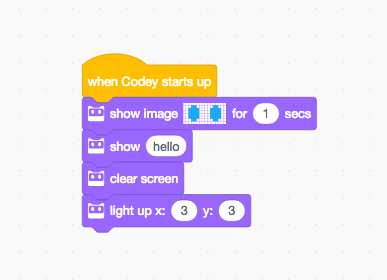

# Codey

**Function**

when codey starts up

```text
import codey
```

when receive（message）

```text
def callback():
    pass
codey.on_message(msgstr, callback)
```

broadcast 'hello'

```text
codey.message('hello')
```

**Example1**

```text
import codey

codey.show('hello world')
```

**Example2**

```text
import codey

def on_start_callback():
    codey.message('hello')

codey.on_start(on_start_callback)

def on_message_callback():
    codey.show('hello world')

codey.on_message('hello', on_message_callback)
```

## Rocky

rocky is the chassis，containing two wheels, an IR emitter, an IR receiver, a RGB color sensor, a light sensor and a white light emitter

**Function**

move forward at power 50 for 1 sec

```text
rocky.forward(50, 1)
```

move backward at power 50 for 1 sec

```text
rocky.backward(50, 1)
```

turn left at power 50 for 1 sec

```text
rocky.left(50, 1)
```

turn right at power 50 for 1 sec

```text
rocky.right(50, 1)
```

**Example**

```text
    import rocky

    rocky.forward(50, 1)
    rocky.back(50, 1)
    rocky.left(50, 1)
    rocky.right(50, 1)
```

## Face Panel

The face panel is a 8_16 led matrix。Each of the led lights is controlled by api. \*Function_

show image【^\_^】for（1）sec

```text
    codey.face(
        '0 0 0 0 0 0 0 0 0 0 0 0 0 0 0 0'
        '0 0 0 0 1 0 0 0 0 0 0 1 0 0 0 0'
        '0 0 0 1 0 1 0 0 0 0 1 0 1 0 0 0'
        '0 0 1 0 0 0 1 0 0 1 0 0 0 1 0 0'
        '0 0 0 0 0 0 0 0 0 0 0 0 0 0 0 0'
        '0 0 0 0 0 0 0 0 0 0 0 0 0 0 0 0'
        '0 0 0 0 0 0 1 1 1 1 0 0 0 0 0 0'
        '0 0 0 0 0 0 0 0 0 0 0 0 0 0 0 0', 1)
```

show image【^\_^】

```text
    codey.face(
        '0 0 0 0 0 0 0 0 0 0 0 0 0 0 0 0'
        '0 0 0 0 1 0 0 0 0 0 0 1 0 0 0 0'
        '0 0 0 1 0 1 0 0 0 0 1 0 1 0 0 0'
        '0 0 1 0 0 0 1 0 0 1 0 0 0 1 0 0'
        '0 0 0 0 0 0 0 0 0 0 0 0 0 0 0 0'
        '0 0 0 0 0 0 0 0 0 0 0 0 0 0 0 0'
        '0 0 0 0 0 0 1 1 1 1 0 0 0 0 0 0'
        '0 0 0 0 0 0 0 0 0 0 0 0 0 0 0 0')
```

show image【^\_^】at x \[0\], y\[0\]

```text
    codey.face_at(
        '0 0 0 0 0 0 0 0 0 0 0 0 0 0 0 0'
        '0 0 0 0 1 0 0 0 0 0 0 1 0 0 0 0'
        '0 0 0 1 0 1 0 0 0 0 1 0 1 0 0 0'
        '0 0 1 0 0 0 1 0 0 1 0 0 0 1 0 0'
        '0 0 0 0 0 0 0 0 0 0 0 0 0 0 0 0'
        '0 0 0 0 0 0 0 0 0 0 0 0 0 0 0 0'
        '0 0 0 0 0 0 1 1 1 1 0 0 0 0 0 0'
        '0 0 0 0 0 0 0 0 0 0 0 0 0 0 0 0', 0, 0)
```

show "hello world"

```text
codey.show('hello world')
```

clear the screen

```text
codey.clear()
```

light up x:\(0\) y:\(0\)

```text
codey.pixel(x, y)
```

light off x:\(0\) y:\(0\)

```text
codey.pixel_off(0,0)
```

**Example**



```text
    import codey


    codey.face(
        '0 0 0 0 0 0 0 0 0 0 0 0 0 0 0 0'
        '0 0 0 1 1 0 0 0 0 0 0 1 1 0 0 0'
        '0 0 1 1 1 1 0 0 0 0 1 1 1 1 0 0'
        '0 0 1 1 1 1 0 0 0 0 1 1 1 1 0 0'
        '0 0 1 1 1 1 0 0 0 0 1 1 1 1 0 0'
        '0 0 1 1 1 1 0 0 0 0 1 1 1 1 0 0'
        '0 0 0 1 1 0 0 0 0 0 0 1 1 0 0 0'
        '0 0 0 0 0 0 0 0 0 0 0 0 0 0 0 0', 1)
    codey.show('hello')
    codey.clear()
    codey.pixel(3, 3)
```

## RGB LED

In the rocky, there is a rgb led light，which supports to set different colors.

**Function**

LED lights up【red】，for（1）sec

```text
codey.color('#334455', 1)
```

LED lights up【red】

```text
codey.color('#334455')
```

LED lights off

```text
codey.color('#000')
```

set RGB LED value to red（255）green（0）blue（0）

```text
codey.rgb(255, 0, 0)
```

**Example**

```text
import codey

codey.color('#ff0000', 1)
codey.color('#00ff15', 1)
codey.color('#0021ff', 1)
```

## Loud Speaker

**Function**

sound parameters available to select：

* `hello.wav` : hello
* `hi.wav` :hi
* `bye.wav` : bye
* `yeah.wav` : yeah
* `wow.wav` : wow
* `laugh.wav` : laugh
* `hum.wav` : hum
* `sad.wav` : sad
* `sigh.wav` : sigh
* `annoyed.wav` : annoyed
* `angry.wav` : angry
* `surprised.wav` :  scared
* `yummy.wav` :  pettish
* `curious.wav` : curious
* `embarrassed.wav` : embarrassed
* `ready.wav` : ready
* `sprint.wav` :  sprint
* `sleepy.wav` :  snore
* `meow.wav` :  meow
* `start.wav` :  start
* `switch.wav` :  switch
* `beeps.wav` :  beeps
* `buzzing.wav` :  buzz
* `exhaust.wav` :  air-out
* `explosion.wav` :  explosion
* `gotcha.wav` :  gotcha
* `hurt.wav` :  painful
* `jump.wav` :  jump
* `laser.wav` :  laser
* `level up.wav` :  level-up
* `low energy.wav` :  low-energy
* `metal clash.wav` :  metal-clash
* `prompt tone.wav` :  prompt-tone
* `right.wav` :  right
* `wrong.wav` : wrong
* `ring.wav` :  ringtone
* `score.wav` :  score
* `shot.wav` :  shot
* `step_1.wav` :  step\_1
* `step_2.wav` : step\_2
* `wake.wav` :  activate
* `warning.wav` :  warning

play sound【hello】. The sound can be interrupted. codey.say\('hello.wav'\)

play sound【hello】until done. The sound won't be interrupted.

```text
codey.say('hello.wav', True)
```

stop the sound

```text
codey.mute()
```

play note（60）for（0.25）beat。参照表待定。

```text
codey.play(435, 500)
```

stop（0.25）beat

```text
todo
```

play sound at frequency of \(700\) HZ for \(1\) sec

```text
todo
```

change volume by（-10）

```text
codey.change_volume(-10)
```

set volume to（100）

```text
codey.set_volume(100)
```

volume

```text
codey.get_volume()
```

**Example**

```text
import codey

codey.set_volume(100)
codey.say('hello.wav', True)
codey.say('hi.wav', True)
```

## Gyroscope

**Function**

when codey is shaking

```text
def callback():
    pass
codey.on_shake(callback)
```

when codey is【forward，backward，leftward，rightward】tilted。The first parameter available to select is：`forward`，`backward`，`left`，`right`。

```text
def callback():
    pass
codey.on_tilt('forward',callback)
```

**Example**

```text
import codey

def on_shake_callback():
    codey.color('#ff0000')

codey.on_shake(on_shake_callback)
```

## IR reception emitter

**Function**

\*\*Example&gt;

## Button

codey has three buttons, `A`, `B`, `C`。

**Function**

when button【A, B, C】is pressed

```text
def callback():
    pass
codey.on_button('A', callback)
```

The first parameter can be：`A`，`B`，`C`。

**Example**

```text
import codey

def on_button_callback():
    codey.color('#ff0000')

codey.on_button('A', on_button_callback)
```

## Gear Potentiometer

**Function**

**Example**

## Light Sensor

**Function**

when light intensity ＜（10）

```text
def callback():
    pass

codey.on_light_under(50, callback)
```

**Example**

```text
import codey

def on_light_under_callback():
    codey.color('#ff0000')

codey.on_light_under(10, on_light_under_callback)
```

## Sound Sensor

**Function**

when【loudness】＞（10）

```text
def callback():
    pass

codey.on_sound_over(10, callback)
```

**Example**

```text
import codey

def on_sound_over_callback():
    codey.color('#ff0000')

codey.on_sound_over(10, on_sound_over_callback)
```

## General Syntax-Control

**Function**

wait for 1 sec

```text
import time
time.sleep(1)
```

repeat for 10 times

```text
for count in range(10):
    pass
```

forever

```text
while True:
    pass
```

if...then

```text
if False:
    pass
```

if...then..else

```text
if False:
    pass

else:
    pass
```

wait until

```text
while not False:
    pass
```

repeat until

```text
while not False:
    pass
```

## General Syntax-Operators

**Function**

1 + 1

```text
1 + 1
```

1 - 1

```text
1 - 1
```

1 \* 1

```text
1 * 1
```

1 / 1

```text
1 / 1
```

pick random 1 to 10

```text
import random
random.randint(1, 10)
```

1 &lt; 2

```text
1 < 2
```

1 == 1

```text
1 == 1
```

2 &lt; 1

```text
2 < 1
```

and

```text
False and False
```

or

```text
False or False
```

not

```text
not True
```

connect `hello` and `world`

```text
str('hello') + str('world')
```

the 1 string of `word`

```text
'world'[0]
```

length of `word`

```text
len('world')
```

`hello` contains `world`？

```text
str('hello').find(str('world')) > -1
```

1 mod 3

```text
1 % 3
```

round `3.4`

```text
round(3.4)
```

abs`-1`

```text
import math
math.fabs(-1)
```

ceiling `3.4`

```text
import math
math.ceil(3.4)
```

sqrt`4`

```text
import math
math.sqrt(4)
```

sin`2`

```text
import math
math.sin(2 / 180.0 * math.pi)
```

cos`2`

```text
import math
math.cos(2 / 180.0 * math.pi)
```

tan`2`

```text
import math
math.tan(2 / 180.0 * math.pi)
```

asin`2`

```text
import math
math.asin(2) / math.pi * 180
```

acos`2`

```text
import math
math.acos(2) / math.pi * 180
```

atan`2`

```text
import math
math.atan(2) / math.pi * 180
```

`ln2`

```text
import math
math.log(2)
```

`log2`

```text
import math
math.log10(2)
```

`e^2`

```text
import math
math.exp(2)
```

`10^2`

```text
import math
math.pow(10,2)
```

