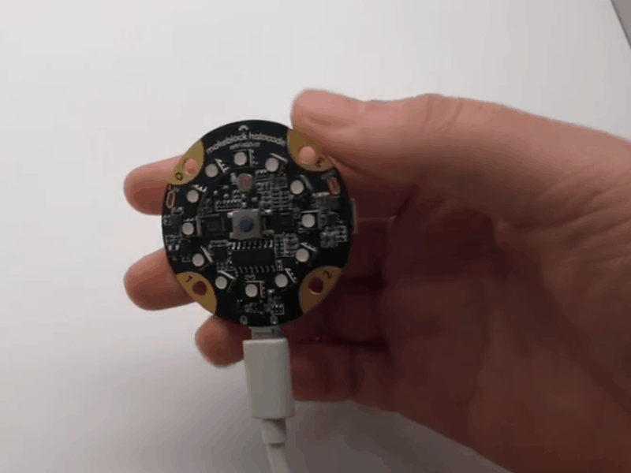
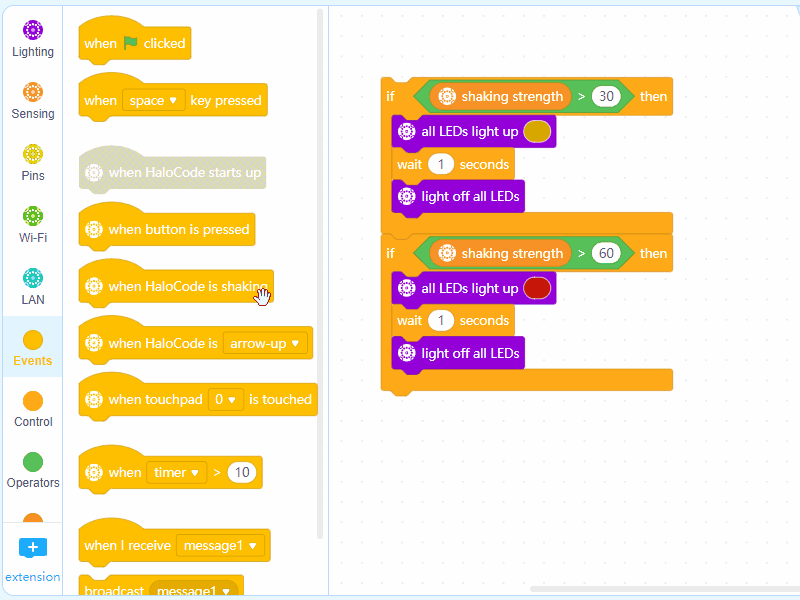

# Untitled

**Compare Strength**

**Programming Result**

**Introduction to HaloCode's motion sensor**

The motion sensor detects how HaloCode moves, including shaking strength.

**Set the range of shaking strength**

1. Drag an Operators block \(\) &gt; \(\) to the Scripts area, and change the value of the second parameter to "30". Add a Sensing block shaking strength to the first parameter.

2. Add a Control block if \(\) then \(\).

**Set LED animation**

3. Add a Lighting block all LEDs light up \(\), and a Control block wait \(\) seconds. Add another Lighting block light off all LEDs to light off all LEDs in 1 second.

4. Likewise, for shaking strength greater than 60, we can duplicate the script. Change the value to 60 and LED color to red.

**Add event and control**

5. Add an Events block when HaloCode is shaking and a Control block forever.

**Read shaking strength**

6. Check the box for Sensing block shaking strength.

7. Shake HaloCode! See if you can make the LED ring light up red.

