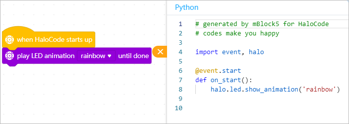

# Use Python with HaloCode

HaloCode is a MicroPython-based single board computer.  
Python code need to be uploaded to HaloCode to run.

**Start Using Python**

Switch the programming mode from "Blocks" to "Python" to start using Python.


**Note: please make sure that "HaloCode" is currently selected.**


Here's an example code:

```text
import halo
import event
@event.start
def on_start():
 halo.led.show_all(122, 239, 10)
 time.sleep(3)
 halo.led.off_all()
```

After programming, click "Upload" to upload the program to HaloCode.


**Convert Blocks to Python Code**

In the Scripts area, click      to covert blocks to Python. The following is an example:



**Use HaloCode's LEDs**

**LED Ring**

The ID and position of each of the 12 LEDs are as follows:


**led.show\_all\(r, g, b\)**

Set the color of all the LEDs, mixed by red, green, and blue, each color with a value range 0-255.

```text
halo.led.show_all(255, 0, 0) # Set all the LEDs to color red
```

**led.off\_all\(\)**

Turn off all the LEDs.

```text
halo.led.off_all() # Turn off all the LEDs
```

**led.show\_ring\(color\)**

Set the color of all 12 LEDs at the same time. There are ten colors: red, green, blue, yellow, cyan, purple, white, orange, black, and gray.

halo.led.show\_ring\('red orange yellow green cyan blue purple white white white white white'\) \# Set the 12 LEDs to color red, orange, yellow, green, cyan, blue, purple, white, white, white, white, and white respectively

**led.show\_single\(led\_id, r, g, b\)**

Set the color of one specified LED.

```text
halo.led.show_single(1, 255, 0, 0) # Set the color of the first LED to red
```

**led.off\_single\(led\_id\)**

Turn off one specified LED.

```text
halo.led.off_single(4) # Turn off the fourth LED
```

**led.show\_animation\(name\)**

Show the default LED animation. There are four options: spoondrift, meteor, rainbow, and firefly.

```text
halo.led.show_animation('rainbow') # Show the "rainbow" LED animation
```

**led.ring\_graph\(percentage\)**

Use the status of the LED ring to display percentage.

```text
halo.led.ring_graph(60) # Use the LED ring to display 60%
```

**Use the Sensors of HaloCode**

**button.is\_pressed\(\)**

If the button is pressed, return True; otherwise, return False.

```text
print(halo.button.is_pressed()) # Print True if the button is pressed
```

**microphone.get\_loudness\(\)**

Get the loudness of the microphone. The range is 0-100.

```text
print(halo.microphone.get_loudness()) # Output the loudness
```

**motion\_sensor.is\_shaked\(\)**

Tell whether HaloCode is being shaken. The result is True or False.

```text
print(halo.motion_sensor.is_shaked()) # If HaloCode is being shaken, return True
```

**motion\_sensor.is\_tilted\_left\(\)/motion\_sensor.is\_tilted\_right\(\)**

Tell whether HaloCode is tilted to the right or left. The result is True or False.

```text
print(halo.motion_sensor.is_tilted_left()) # If HaloCode is left-tilted, return True
```

**motion\_sensor.is\_arrow\_up\(\)/motion\_sensor.is\_arrow\_down\(\)**

Tell whether HaloCode is placed arrow-up or arrow-down. The result is True or False.

```text
print(halo.motion_sensor.is_arrow_up()) # If HaloCode is placed arrow-up, return True
```

**Gyroscope**

Get the roll, pitch or yaw value of HaloCode's gyroscope

* motion\_sensor.get\_roll\(\)
* motion\_sensor.get\_pitch\(\)
* motion\_sensor.get\_yaw\(\)

Get the gyroscope's rotation value \(in degrees\) around a certain axis.

* motion\_sensor.get\_rotation\(axis\): x, y, or z axis
* motion\_sensor.reset\_rotation\(axis="all"\): reset the rotation angles of the gyro

You can use motion\_sensor.get\_shake\_strength\(\) to get the intensity of the shaking.

```text
print("The yaw and pitch is:", halo.motion_sensor.get_yaw(), halo.motion_sensor.get_pitch()) # output the yaw and pitch value of the gyro
print("The rotation value is:", halo.motion_sensor.get_rotation(x), halo.motion_sensor.get_rotation(y), halo.motion_sensor.get_rotation(z))
halo.motion_sensor.reset_roation() # reset the rotation value.
print("Shake strength:", halo.motion_sensor.get_shake_strength())
```

**get\_timer\(\)**

Get the timer value in seconds \(since startup or last reset\).

```text
print(halo.get_timer()) # print the timer value since startup or last reset
```

**reset\_timer\(\)**

Reset the timer.

```text
halo.reset_timer()
print(halo.get_timer()) # prints 0
```

**HaloCode's Event and Flow Control**

HaloCode supports events \(like when the button is pressed\), and it also supports multi-threading.

If you wish to use event, declare a function and register it to the event. A program can only register no more than 6 event functions.

Example:


```text
def on_button_pressed(): # define a function
print("The button is pressed!")
halo.on_button_pressed() # register it to "when button is pressed" event
```

**on\_button\_pressed\(\)**

When the button is pressed, run the function.

```text
def on_button_pressed():
 print("The button is pressed!")
halo.on_button_pressed()
```

**on\_shaked\(\)**

When HaloCode is being shaken, call the function.

```text
def on_shaked():
 print("I'm shaken!")
halo.on_shaked()
```

**on\_tilted\_left\(\)**

Call the function when HaloCode is tilted to the left.

```text
def on_tilted_left():
 print("I'm left-tilted!")
halo.on_tilted_left()
```

**on\_greater\_than\(volume, 'microphone'\)**

When the loudness is over a certain value, call the function.

```text
def on_greater_than():
 print("The loudness is over 50! Too loud!")
halo.on_greater_than(50, 'microphone')
```

**on\_received\(message\_name\)**

When the specified message is received, call the function.

```text
def on_received():
 print("Game start!")
halo.on_received("game_start")
```

