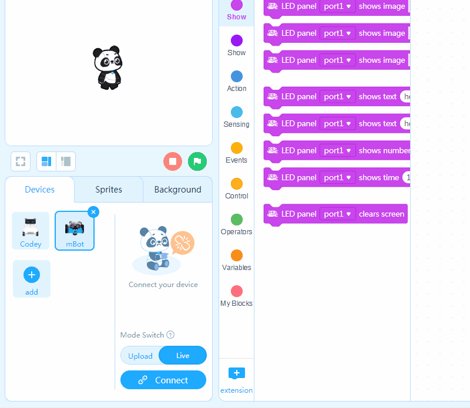
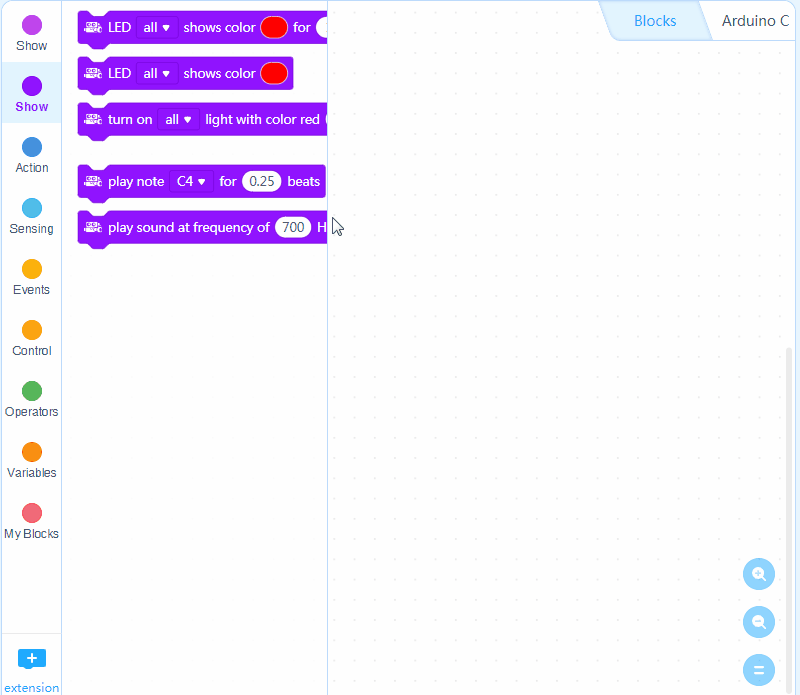
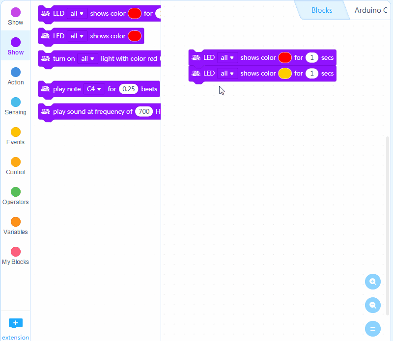
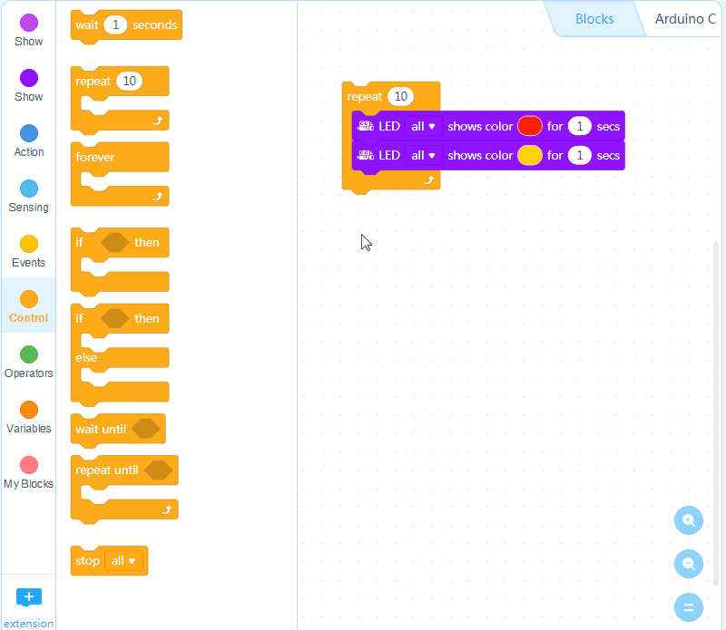
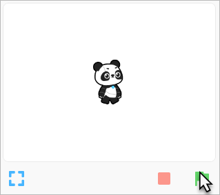

# Get Started

## Connect mBot 

1. Click "Connect" to connect mBot.

## Start programming 

1. Drag two Show blocks LED\(all\) shows color \(\) for \(\) secs to the Scripts area. Change the color of the second block to yellow.

1. Add a Control block repeat \(10\) to wrap up the two Show blocks.

1. Add an Events block when green flag clicked and snap it on top of other blocks.

1. Click the green flag under the stag and see what happens.

