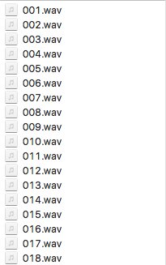

# Grove Speech Recognizer Kit for Arduino


The Grove Speech Recognizer Kit for Arduino is designed for prototype of Smart Home which includes some basic home elements such as Speech Recognizer, Infrared Emitter. You can learn the functions and applications of Speech Recognizer quickly via this kit, the guideline shows some common demos, let's say you can play music via your speak command 'Play music', or turn on the light according to the corresponding command.

### Part List

1. Grove - Speech Recognizer SKU:101020232
2. [Grove - MP3 v2.0](/Grove-MP3_v2.0)
3. [Grove – RTC](//grove-rtc/)
4. [Base Shield](/Base_Shield_V2/)
5. [Grove - Infrared Receiver](/Grove-Infrared_Receiver/)
6. [Grove - Infrared\_Emitter](/Grove-Infrared_Emitter/)

### Application

#### How to turn on the TV

Sometimes, we want to control something by our voice, such as TV, air condition. Those devices are controlled by Infrared Remote controller, so we need to know what the code of each button of infrared remote controller first, and then put the code under our program. Finally your voice could trigger those button codes and you can control those devices like infrared remote controller.

Before create this demo you should prepare some necessary components:

* Grove - Infrared Receiver
* Grove - Infrared Emitter
* Grove - Speech Recognizer
* Base Shield
* Arduino UNO
* Infrared Remote controller

**Get code of a infrared remote controller via Grove - Infrared Receiver**

Download necessary libraries from github : [IRSendRev](https://github.com/Seeed-Studio/IRSendRev) ,pay attention to the path of your libraries: .../arduino/libraries

* Now open the example file of "recv" : File --&gt; Sketchbook --&gt; libraries --&gt; IRSendRev --&gt; recv.
* Upload the program to your Arduino UNO.
* Plug Base Shield onto the Arduino UNO,and plug the Grove - Receiver onto the D2 port of Base Shield.

```text
const int pinRecv = 2;
```

Also you can change another port while modifying the definement of pin. &lt;/dd&gt;&lt;/dl&gt;

* Open the monitor of Arduino UNO.

Press a button of any Infrared Remote Controller, you'll get the detailed information code of the button, see following:


Write down the detailed information of the button you want to press. Following are the information of a button:

```text
+------------------------------------------------------+
LEN = 9
START_H: 179    START_L: 88
DATA_H: 11    DATA_L: 33

DATA_LEN = 4
DATA: 0x80    0x7E    0x10    0xEF
DATA: 128    126    16    239
+------------------------------------------------------+
```

**Modify the IRSend program**

Now we can use the previous information code of a button.

* Open the example file of "send" : File --&gt; Sketchbook --&gt; libraries --&gt; IRSendRev --&gt; send.
* Upload the program to your Arduino UNO.
* Plug Base Shield onto the Arduino UNO,and plug the Grove - Receiver onto the D3 port of Base Shield.

First we need modify the default information of the button:

```text
unsigned char dtaSend[20];

void dtaInit()
{
  ............
}
```

Modify those information according to the previous one you wrote:

```text
unsigned char dtaSend[20];

void dtaInit()
{
    dtaSend[BIT_LEN]        = 9;            // all data that needs to be sent
    dtaSend[BIT_START_H]    = 179;            // the logic high duration of a button
    dtaSend[BIT_START_L]    = 88;            // the logic low duration of a button
    dtaSend[BIT_DATA_H]     = 11;            // the logic "long" duration in the communication
    dtaSend[BIT_DATA_L]     = 33;            // the logic "short" duration in the communication

    dtaSend[BIT_DATA_LEN]   = 4;            // Number of data which will sent. If the number is other, you should increase or reduce dtaSend[BIT_DATA+x].

    dtaSend[BIT_DATA+0]     = 128;            // data that will sent
    dtaSend[BIT_DATA+1]     = 126;
    dtaSend[BIT_DATA+2]     = 16;
    dtaSend[BIT_DATA+3]     = 239;
    //dtaSend[BIT_DATA+4]     = 192;
    //dtaSend[BIT_DATA+5]     = 63;
}
```

You can observe that:

```text
DATA_LEN = 4
```

So you can note or delete those two lines.

```text
   //dtaSend[BIT_DATA+4]     = 192;
    //dtaSend[BIT_DATA+5]     = 63;
```

Of course you can also define many buttons:

```text
#include <IRSendRev.h>

#define BIT_LEN         0
#define BIT_START_H     1
#define BIT_START_L     2
#define BIT_DATA_H      3
#define BIT_DATA_L      4
#define BIT_DATA_LEN    5
#define BIT_DATA        6

const int ir_freq = 38;

unsigned char OpenTV[20];
unsigned char CloseTV[20];
unsigned char IncreaseTemp[20];
unsigned char DecreaseTemp[20];

void OpenTVInit()
{
    OpenTV[BIT_LEN]        = 11;
    OpenTV[BIT_START_H]    = 179;
    /*............ omit ............*/
}

void CloseTVInit()
{
    CloseTV[BIT_LEN]        = 11;
    CloseTV[BIT_START_H]    = 179;
    /*............ omit ............*/
}

void IncreaseTempInit()
{
    IncreaseTemp[BIT_LEN]        = 11;
    IncreaseTemp[BIT_START_H]    = 179;
    /*............ omit ............*/
}

void DecreaseTempInit()
{
    DecreaseTemp[BIT_LEN]        = 11;
    DecreaseTemp[BIT_START_H]    = 179;
   /*............ omit ............*/
}

void setup()
{
    OpenTVInit();
    CloseTVInit();
    IncreaseTempInit();
    DecreaseTempInit();
}

void loop()
{
    IR.Send(OpenTV, 38);
    delay(200);
    IR.Send(CloseTV, 38);
    delay(200);
    IR.Send(IncreaseTemp, 38);
    delay(200);
    IR.Send(DecreaseTemp, 38);

    delay(2000);
}
```

**Add Speech Recognizer to your IRSend program**

* It's very simple to use Speech Recognizer alone, please see the wiki of it first.

We can choose what buttons we need according to the table&lt;ref&gt;Table of return value, [Grove - Speech Recognizer](/Seeed_BLE_Shield_v1)&lt;/ref&gt; of return value of Speech Recognizer. Following is the table of return value:

|  Command |  Return Value |
| :--- | :--- |
|  Turn on the light |  1 |
|  Turn off the light |  2 |
|  Play music |  3 |
|  Pause |  4 |
|  Next |  5 |
|  Previous |  6 |
|  Up |  7 |
|  Down |  8 |
|  Turn on the TV |  9 |
|  Turn off the TV |  10 |
|  Increase temperature |  11 |
|  Decrease temperature |  12 |
|  What's the time |  13 |
|  Open the door |  14 |
|  Close the door |  15 |
|  Left |  16 |
|  Right |  17 |
|  Stop |  18 |
|  Start |  19 |
|  Mode 1 |  20 |
|  Mode 2 |  21 |
|  Go |  22 |

The following example uses two commands: "Turn of the TV" and "Turn off the TV"

* After reading, we can embed the program of Speech Recognizer in the IRSend program. See the following completed program:

```text
#include <IRSendRev.h>
#include <SoftwareSerial.h>

/*========  IR type ========*/

#define BIT_LEN         0
#define BIT_START_H     1
#define BIT_START_L     2
#define BIT_DATA_H      3
#define BIT_DATA_L      4
#define BIT_DATA_LEN    5
#define BIT_DATA        6
const int ir_freq = 38;                 // 38k

/* ========  How many IR buttons you wanna send  ========*/

unsigned char OpenTV[20];
unsigned char CloseTV[20];


/*=========  Choose the pins of Speech Recognizer  ==========*/

#define SOFTSERIAL_RX_PIN  5
#define SOFTSERIAL_TX_PIN  6

SoftwareSerial speech(SOFTSERIAL_RX_PIN,SOFTSERIAL_TX_PIN);


/* =======  How to write the IR data  ========*/
/* ====  You can get those data via IR Recevier  ==== */

void OpenTVInit()
{
    OpenTV[BIT_LEN]        = 9;            // all data that needs to be sent
    OpenTV[BIT_START_H]    = 180;            // the logic high duration of "OpenTV"
    OpenTV[BIT_START_L]    = 88;            // the logic low duration of "OpenTV"
    OpenTV[BIT_DATA_H]     = 11;            // the logic "long" duration in the communication
    OpenTV[BIT_DATA_L]     = 33;            // the logic "short" duration in the communication

    OpenTV[BIT_DATA_LEN]   = 4;            // Number of data which will sent. If the number is other, you should increase or reduce dtaSend[BIT_DATA+x].

    OpenTV[BIT_DATA+0]     = 50;            // data that will sent
    OpenTV[BIT_DATA+1]     = 166;
    OpenTV[BIT_DATA+2]     = 80;
    OpenTV[BIT_DATA+3]     = 175;
}

void CloseTVInit()
{
    CloseTV[BIT_LEN]        = 9;            // all data that needs to be sent
    CloseTV[BIT_START_H]    = 178;            // the logic high duration of "CloseTV"
    CloseTV[BIT_START_L]    = 89;            // the logic low duration of "CloseTV"
    CloseTV[BIT_DATA_H]     = 10;            // the logic "long" duration in the communication
    CloseTV[BIT_DATA_L]     = 33;            // the logic "short" duration in the communication

    CloseTV[BIT_DATA_LEN]   = 4;            // Number of data which will sent. If the number is other, you should increase or reduce dtaSend[BIT_DATA+x].

    CloseTV[BIT_DATA+0]     = 50;            // data that will sent
    CloseTV[BIT_DATA+1]     = 166;
    CloseTV[BIT_DATA+2]     = 168;
    CloseTV[BIT_DATA+3]     = 87;
}


void setup()
{
    OpenTVInit()
    CloseTVInit()
    Serial.begin(9600);
    speech.begin(9600);
    speech.listen();
}

void loop()
{
    int a=0;

    if(speech.available())
    {
        a = speech.read();    // Read the return value from the Speech Recognizer
        switch (a)
        {
            case 9:                     //  if (return value) then send (IR data)
            IR.Send(OpenTV, 38);
            delay(1000);
            break;
            case 10:
            IR.Send(CloseTV, 38);
            delay(1000);
            break;
            default:
            break;
        }
    }
}
```

#### How to control music

Watch the commands of Speech Recognizer, there're many commands which are related to music, such as "Play music", "Pause", "Stop", "Previous", "Next". So let's do this Speech Music Box!

Download necessary libraries from github: [Grove\_Serial\_MP3\_Player\_V2.0](https://github.com/Seeed-Studio/Grove_Serial_MP3_Player_V2.0)&lt;ref&gt;library, [Grove - MP3 v2.0](/Grove-MP3_v2.0)&lt;/ref&gt;, pay attention to the path of your libraries: .../arduino/libraries .

**Useful functions about Grove - MP3 v2**

There're some useful basic functions of Grove - MP3:

```text
PlayPause();    // pause music
PlayResume();   // restart a music
PlayNext();  // next song
PlayPrevious();  // previous song
PlayLoop();  //  loop all songs
SetVolume(uint8_t volume);  // set volume. default value is "0x0E", the range is 0x00 to 0x1E.
IncreaseVolume();  // increase volume
DecreaseVolume();  // decrease volume
```

But there're some special functions you need to pay attention:

* SelectPlayerDevice\(uint8\_t device\). _The default device value is 0x02, Select SD card as the player device._

```text
SelectPlayerDevice(0x02);
```

* SpecifyMusicPlay\(uint16\_t index\). _play a song by name._

​Pay attention to the name of songs, you can set a name like following type:​



So we can play the song "005" by this function:

```text
SpecifyMusicPlay(5);
```

* SpecifyfolderPlay\(uint8\_t folder, uint8\_t index\); // play a song by name in a appointed folder

​Furthermore, sometimes we may play music in a new folder, the previous function comes in handy.​  


### Resource

* [Github: IRSendRev](https://github.com/Seeed-Studio/IRSendRev)
* [Github: MP3](https://github.com/Seeed-Studio/Grove_Serial_MP3_Player_V2.0)
* [Github: RTC](https://github.com/Seeed-Studio/RTC_DS1307)
* [Sound files of broadcast](https://github.com/SeeedDocument/Grove_Speech_Recognizer_Kit_for_Arduino/raw/master/res/Sound_file.zip)

