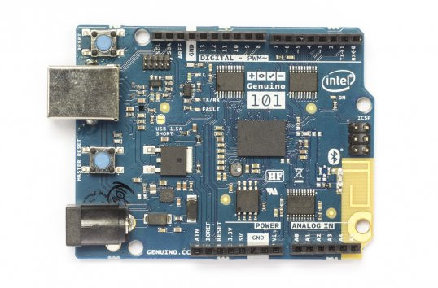
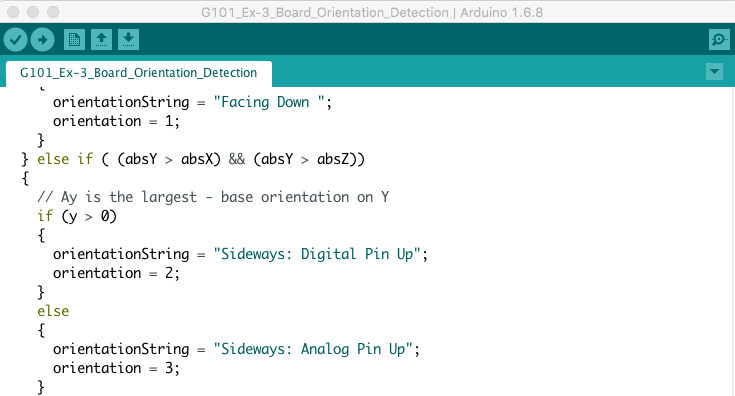
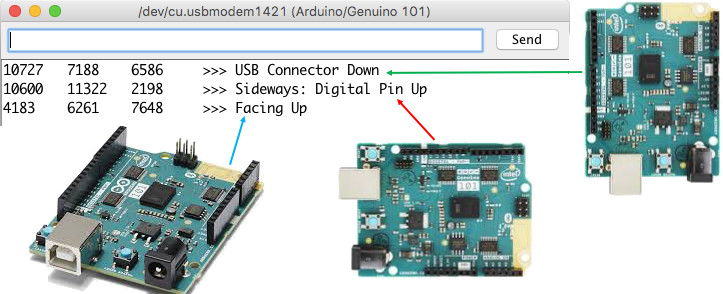

# Board Orientation Detection

## Learning Objectives:

After performing this lab exercise, you will be able to:

* Create Arduino sketch \(code\) and program Arduino/Genuino 101 board
* Understand the working of Accelerometers
* Read the acceleration experienced by the Arduino/Genuino 101 board using on-board on-board accelerometers
* Process the accelerometer signals to estimate the board orientation

## Tools and Components Required:

To perform this lab experiment, you will need:

[http://www.pakronics.com.au/collections/genuino-arduino-cc/products/genuino-101-pakr-m0012 ](http://www.pakronics.com.au/collections/genuino-arduino-cc/products/genuino-101-pakr-m0012%20)

[http://www.pakronics.com.au/products/9v-battery-clip-with-5-5mm-2-1mm-plug-ada80](http://www.pakronics.com.au/products/9v-battery-clip-with-5-5mm-2-1mm-plug-ada80)

## Working principle of key components

Before performing this lab experiment, it is important to learn following concepts:

* Arduino/Genuino 101 is a low-power consumption and high-performance version of Arduino board with Bluetooth low-energy \(BLE\) and accelerometer on board. It is compatible with Arduino/Genuino Uno in term of form factor and peripheral list. \(For more details, please visit: [https://www.arduino.cc/en/Main/ArduinoBoard101](https://www.arduino.cc/en/Main/ArduinoBoard101)\).
* Arduino/Genuino 101 can be easily programmed using Arduino IDE \(version 1.6.7 and higher\). However, the hardware libraries for Arduino/Genuino 101 board needs to be updated / installed. \(Refer appendix for detailed procedure\).
* An accelerometer measures proper acceleration \(g-force\), which is the acceleration it experiences relative to freefall and is the acceleration felt by people and objects. An accelerometer at rest would experience and measure an acceleration of 9.81m/s2 or simply 1g.
* Arduino/Genuino 101 has on-board inertial measurement unit \(IMU\) – BMI 160, developed by Bosch. BMI 160 IMU consists of a low-power 3-axis accelerometer and a 3-axis gyroscope. \( A Details datasheet is available at : [http://ae-bst.resource.bosch.com/media/\_tech/media/datasheets/BST-BMI160-DS000-07.pdf](http://ae-bst.resource.bosch.com/media/_tech/media/datasheets/BST-BMI160-DS000-07.pdf)\).
* CurieIMU library is used for working with the on-board IMU of Arduino/Genuino 101. Using this library, you can access all the parameters, features and reading of IMU chip.
* Based on the orientation of the board, the acceleration value for 3-axis would change. At rest, the axis facing opposite to gravity will indicate acceleration of 1g \(16K ADC levels\). The axis facing downwards \(aligned with gravity\) will indicate -1g \(negative sign indicates pull towards earth’s gravity\).
* The axes perpendicular to earth’s gravity will indicate 0g.
* Thus when board is held with USB connector facing downwards, x-axis would indicate acceleration value of +1g.

 

* The orientation detection mechanism is used in smartphones to stop the caller tone / snooze alarm when the phone is flipped.

## Key commands

Before programming the Arduino/Genuino 101, it is important to learn following key commands:

* CurieIMU.begin
  * Initialize the IMU of the board
* CurieIMU.setAccelerometerRange
  * Set the accelerometer range in terms of ‘g’
* CurieIMU.readAccelerometer
  * Read the acceleration values \(Ax, Ay and Az\) from on-board IMU
* digitalWrite
  * Turn on/off a digital pin of the Arduino / Genuino board
* abs
  * Returns the absolute value of the input

## Check Your Understanding

1. IMU stands for:
   1. Input Measurement Unit
   2. Input Microprocessing Unit
   3. Inertial Measurement Unit
   4. Isolation Measurement Unit
2. Arduino/Genuino 101 board is kept on a table. The axis facing upwards would indicate:
   1. +1g
   2. -1g
   3. +2g
   4. -2g
3. Arduino/Genuino 101 board is kept on a table with ‘digital pin edge’ facing upwards. Which axis will show +1g acceleration?
   1. X-axis
   2. Y-Axis
   3. Z-axis
   4. No axis will show +1g, one of them would indicate -1g.
4. CurieIMU.begin command will
   1. Initialize the IMU
   2. Start reading the acceleration values from IMU
   3. Set the ‘g’ range
   4. Read the gyroscope values
5. What is NOT part of Genuino 101 board?
   1. Accelerometer
   2. Pizzo Buzzer
   3. Bluetooth
   4. Analog pins
6. CurieIMU. setAccelerometerRange command will
   1. Initialize the IMU
   2. Start reading the acceleration values from IMU
   3. Set the ‘g’ range
   4. Read the gyroscope values
7. CurieIMU. readAccelerometer command will
   1. Initialize the IMU
   2. Read the acceleration values from IMU
   3. Set the ‘g’ range
   4. Read the gyroscope values from IMU

## Procedure

### Hardware Setup

* Connect the Arduino/Genuino 101 board with computer using USB cable.

### Arduino IDE / Library Setup

* Make sure you have Arduino IDE version 1.6.7 or higher and Intel Genuino 101 drivers installed on your computer. For installation of Arduino IDE and drivers, you can follow instructions from Appendix A.

### Creating Sketch / Program

* Open the sketch \(G101\_Ex-3\_Board\_Orientation\_Detection.ino\) on Arduino IDE.

* From Tools menu, select the right board \(i.e., Arduino/Genuino 101\) and COM Port it is connected to.

* Compile \(verify\) and run \(upload\) the sketch on Arduino board. In case of any upload error, try pressing the Master Reset Button just at the start of upload process.

* Open the “serial monitor” of Arduino IDE. It will be used to display the accelerometer values and board orientation.

* Keep the Arduino/Genuino 101 board on a table. When it is at rest, the LED \(on-board LED at pin 13\) will be off. Initially nothing would come up on the Serial monitor.
* Now change the orientation of the board – flip it or put analog pin side up etc. The LED should blink as and when you change the orientation of the board. The orientation of the board and acceleration values for 3-axis corresponding to that orientation would be displayed on serial monitor.

* Verify the value of the accelerometers and orientation reported by the program against actual orientation of the board.

## Additional Exercise

You can extend your learning by trying following programming exercises:

1. Make a system where the LED on board blinks every 20s, simulating a caller ring. The blink should be turned off when the board is flipped upside down \(components facing down\).
2. Combine the current program with Bluetooth and make an orientation detector where the board orientation is indicated on a mobile through Bluetooth app.

