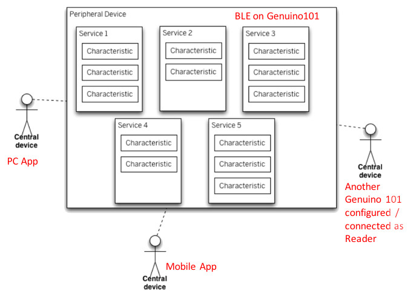
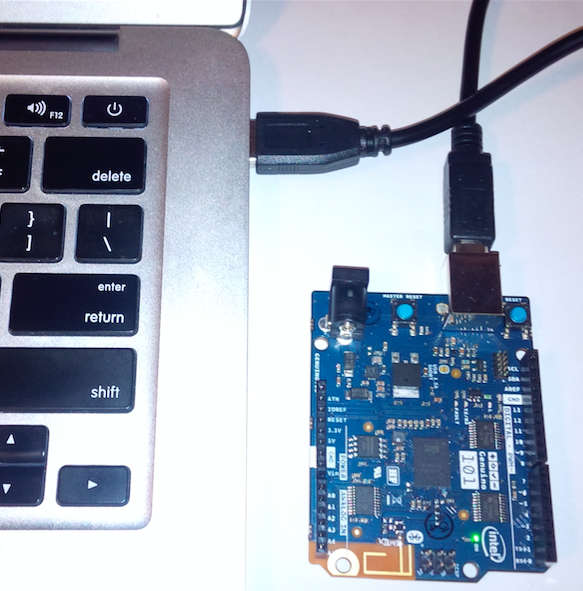
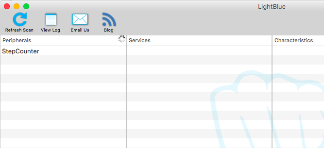
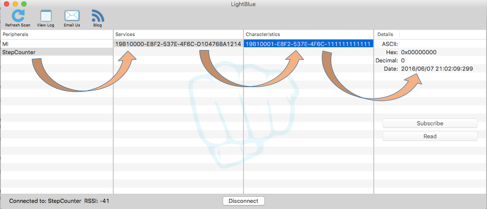

# Pedometer – Step Counting Over Bluetooth

## Learning Objectives:

After performing this lab exercise, you will be able to:

* Create Arduino sketch \(code\) and program Arduino/Genuino 101 board
* Understand the working of Bluetooth Low Energy protocol
* Work with on-board accelerometers \(Inertial Measurement Units\) to calculate step count
* Create a BLE service and transmit step count using Genuino 101 board
* Connect to Genuino 101 board service from PC/mobile BLE app and receive step count over Bluetooth

## Tools and Components Required:

To perform this lab experiment, you will need:

[http://www.pakronics.com.au/collections/genuino-arduino-cc/products/genuino-101-pakr-m0012](http://www.pakronics.com.au/collections/genuino-arduino-cc/products/genuino-101-pakr-m0012)

[http://www.pakronics.com.au/products/9v-battery-clip-with-5-5mm-2-1mm-plug-ada80](http://www.pakronics.com.au/products/9v-battery-clip-with-5-5mm-2-1mm-plug-ada80)

## Working principle of key components

Before performing this lab experiment, it is important to learn following concepts:

* Arduino/Genuino 101 is a low-power consumption and high-performance version of Arduino board with Bluetooth low-energy \(BLE\) and 6-axis accelerometer on board. It is compatible with Arduino/Genuino Uno in term of form factor and peripheral list. \(For more details, please visit: [https://www.arduino.cc/en/Main/ArduinoBoard101](https://www.arduino.cc/en/Main/ArduinoBoard101)\).
* Arduino/Genuino 101 can be easily programmed using Arduino IDE \(version 1.6.7 and higher\). However, the hardware libraries for Arduino/Genuino 101 board needs to be updated / installed. \(Refer appendix for detailed procedure\).
* CurieBLE library is used for programming the on-board BLE of Arduino/Genuino 101. Bluetooth 4.0 supports both traditional Bluetooth and the new Bluetooth Low Energy \(or BLE\). BLE is optimized for lower power consumption at lower data rates. \(further details: [https://www.arduino.cc/en/Main/ArduinoBoard101](https://www.arduino.cc/en/Main/ArduinoBoard101)\).
* A BLE device can act as peripheral device \(or bulletin board\) or central device \(reader\). A bulletin would post data in the form of characteristics of different services. These characteristics from bulletin \(or peripheral BLE device\) can be read or written by reader \(central BLE devices\).

* The information presented by the peripheral or bulletin is structured as services. Each service is further divided into characteristics. These characteristics are the actual data that is exchanged between peripheral and central devices.
* One can use a standard service or define an own custom service. A standard service has 16 bit \(or 4 hex characters\) Universally Unique Identifier \(UUID\) whereas a custom UUID has 128 bits \( = 32 hex characters\). A service can have multiple characteristics. A characteristics value can be up to 20 bytes long.
* An accelerometer measures proper acceleration \(g-force\), which is the acceleration it experiences relative to freefall and is the acceleration felt by people and objects. An accelerometer can sense both statics \(acceleration at rest\) and dynamic \(acceleration due to motion\) acceleration.
* Arduino/Genuino 101 has on-board inertial measurement unit \(IMU\) – BMI 160, developed by Bosch. BMI 160 IMU consists of a low-power 3-axis accelerometer and a 3-axis gyroscope. \(A Details datasheet is available at : [http://ae-bst.resource.bosch.com/media/\_tech/media/datasheets/BST-BMI160-DS000-07.pdf](http://ae-bst.resource.bosch.com/media/_tech/media/datasheets/BST-BMI160-DS000-07.pdf)\).
* CurieIMU library is used for working with the on-board IMU of Arduino/Genuino 101. This library also provides the function for counting steps by analyzing the accelerometer signals.
* As demonstrated in this tutorial, a service can be created with a characteristic for notification of step count. A central device \(a mobile or PC app\) would need to subscribe to the service/characteristics thus enabling it to receive the updated step count as soon as it changes.

## Key commands

Before programming the Arduino/Genuino 101, it is important to learn following key commands:

* blePeripheral.setDeviceName
  * Sets the BLE device name as descriptor for other devices to identify
* blePeripheral.setAdvertisedServiceUuid
  * Set the UUID of the service to be provided
* blePeripheral.addAttribute
  * Add services or characteristics to the BLE peripheral
* blePeripheral.setEventHandler
  * Assign callback functions for different BLE peripheral events
* characteristics.setValue
  * Sets the value of the ‘characteristics’
* characteristics.Value
  * Gets the value of the ‘characteristics’
* blePeripheral.poll
  * Polls \(looks for\) any even related to BLE peripheral
* CurieIMU.begin
  * Initialize the IMU of the board
* CurieIMU.setStepCountEnabled
  * Enable the step counting
* CurieIMU.setStepDetectionMode
  * Turn on the step detection mode
* CurieIMU.getStepCount
  * Reads the step count

## Check Your Understanding

1. A BLE device can be configured as:
   1. Reader or central device
   2. Bulletin or peripheral device
   3. Both a & b
   4. None of a & b
2. A standard service has UUID of length \_\_\_\_
   1. 16 bytes
   2. 16 bits
   3. 128 bytes
   4. 128 bits
3. Which of the following command would read the value of the characteristics?
   1. characteristics.setValue
   2. characteristics.Value
   3. characteristics.readValue
   4. characteristics.returnValue
4. UUID stands for
   1. Undoubtedly Unique Identifier
   2. User-defined Unique Identifier
   3. Universally Unique Identifier
   4. Unique User Identifier
5. CurieIMU.setStepCountEnabled command will
   1. Initialize the IMU
   2. Enable the step counting
   3. Set the callback function upon step detection
   4. Turn on the step detection mode
6. CurieIMU.setStepDetectionMode command will
   1. Initialize the IMU
   2. Enable the step counting
   3. Set the callback function upon step detection
   4. Turn on the step detection mode
7. A characteristic value can have a maximum length of \_\_\_
   1. 8 bytes
   2. 16 bytes
   3. 20 bytes
   4. 4 bytes

## Procedure

### Hardware Setup

* Connect the Arduino/Genuino 101 board with computer using USB cable.

### Arduino IDE / Library Setup

* Make sure you have Arduino IDE version 1.6.7 or higher and Intel Genuino 101 drivers installed on your computer. For installation of Arduino IDE and drivers, you can follow instructions from Appendix A.

### Creating Sketch / Program

* Open the sketch \(G101\_Ex-4\_Bluetooth\_Pedometer.ino\) on Arduino IDE.

* From Tools menu, select the right board \(i.e., Arduino/Genuino 101\) and COM Port it is connected to.

* Compile \(verify\) and run \(upload\) the sketch on Arduino board. In case of any upload error, try pressing the Master Reset Button just at the start of upload process.

### BLE App \(PC / Mobile\) Setup

* BLE is supported only on Bluetooth 4.0 hardware. Ensure your computer / mobile / tablet hardware supports BLE. You’ll need appropriate BLE app to communicate with Genuino 101 over Bluetooth. We recommend following free apps: LightBlue for Mac and nRF Master Control for mobile \(Android / iOS\).
* Open the app and scan for Bluetooth devices. Arduino / Genuino 101 should appear with the name “StepCounter”.

* Click on “StepCounter” under the list of peripherals to connect to it. Successful connection will be indicated in two ways – \(i\) on-board LED at pin 13 would glow, \(ii\) the services offered by the device would show up in ‘services’ column. Selecting a service will show associated characteristics in respective tabs.

* Clicking on “Subscribe” button will register the app for receiving the notifications of change in this characteristics \(step count\) value.
* After subscribing, shake the Arduino/Genuino 101 board as if you are walking holding in your hand. You should see the count value changing on the app.

* You can try powering the board, after uploading of the sketch, using a battery pack and hold it while you walk around. You can see the electronic, wireless pedometer in action.

## Additional Exercise

You can extend your learning by trying following programming exercises:

1. Convert the existing step counting mechanism to detect any other form of exercise \(say squatting / sit-ups\) by analysing the accelerometer signals and finding the exercise signature. Program the 101 board in such a way that when you perform that specific exercise, the count can be seen on mobile app.
2. Extend the existing pedometer to show – \(1\) distance covered through walk and \(2\) energy / calories burnt on Bluetooth.

